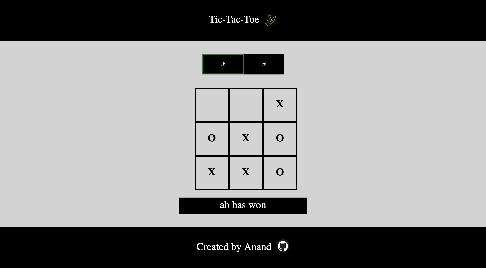

# tic-tac-toe
This project makes a two player and a single player tic tac toe mode
This project was made with the objective to practice the use of objects in javascript
In the tic-tac-toe game the one with three same markers in a column or row or a diagonal wins the game.If no one wins the game and the board is filled then the the game is tied
The live demonstration of the project can be found at https://anandb104.github.io/tic-tac-toe/
